# GEIF: Empirical Heatmaps, Topological Tuning & CEIF Comparison

This document provides visual anomaly score heatmaps for **GEIF (Geometric Extended Isolation Forest)** across a diverse suite of 2D synthetic topologies, mirroring the benchmark investigations established in `ceif/docs/tweaking.md`.

Visualizing the decision manifold in 2D illustrates how GEIF's algorithmic design choices—**Voronoi hyperplane bisectors**, **Cauchy-Lorentz residual cell damping**, **Euclidean stadium outer space decay**, and **Zero Kelvin scale calibration**—govern model inference across challenging geometries.

---

## 1. Benchmark Datasets

We evaluate GEIF on six standard topological benchmarks matching CEIF:
1. **Two Blobs (`2blob.csv`)**: Two separated Gaussian clusters (1,000 points).
2. **Square (`square.csv`)**: Uniform grid of points forming an open square boundary (76 points).
3. **Circle (`circle.csv`)**: A single circular ring distribution (360 points).
4. **Two Circles (`2circle.csv`)**: Concentric ring structure with a central and intermediate void (720 points).
5. **Complex 2D (`complex2d.csv`)**: Multi-scale non-convex teapot with an annular donut hole, 3 radiating needle spikes, an outer crescent arc, and an isolated Gaussian sub-cluster (1,465 points; 5000:1 aspect ratio).
6. **Elongated Diagonal (`Wtest.csv`)**: Narrow linear cluster with extreme dimension magnitude disparity ($X \in [5, 120]$ vs. $Y \in [10^5, 2 \times 10^6]$).

### Baseline Sample Distributions (Training Data)

| Two Blobs | Square | Circle |
|:---:|:---:|:---:|
| 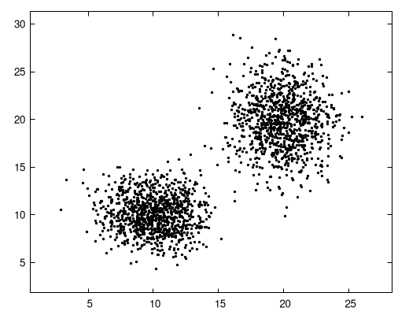 | 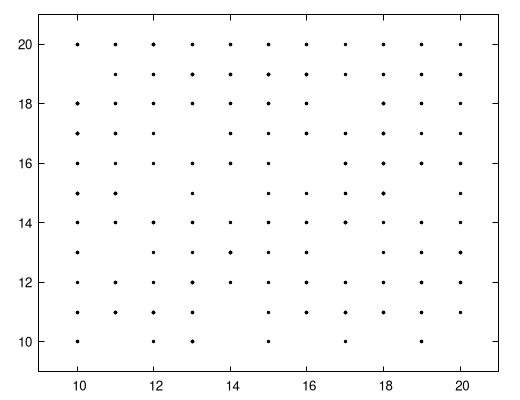 | 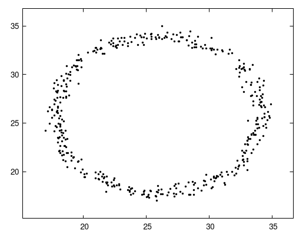 |

---

## 2. Decision Boundaries & Calibrated Thresholds

In these anomaly maps:
- **Black dots**: Original training samples.
- **White regions**: Inliers (points with anomaly score $< T$).
- **Yellow $\to$ Orange $\to$ Red gradient**: Outliers (points with anomaly score $\ge T$ saturated towards 1.0).

### Comparison Across Scoring Thresholds ($T$)

In classic `ceif`, raw anomaly scores vary significantly between topologies (often clustering between 0.35 and 0.85), requiring a post-hoc scaling flag (`-O 0.5s`) or empirical percentile ranking (`-O 97%`).

In contrast, **GEIF features universal Zero Kelvin scale calibration**:
- $T = 0.00$: Full continuous score landscape (showing depth gradients everywhere).
- $T = 0.35$: Dense core inlier regime.
- $T = 0.50$: Calibrated universal default boundary.

| Outlier Threshold ($T$) | Two Blobs (`2blob`) | Square (`square`) | Circle (`circle`) |
|:---|:---:|:---:|:---:|
| **Training Data** |  |  |  |
| **$T = 0.00$** (Full Field) | 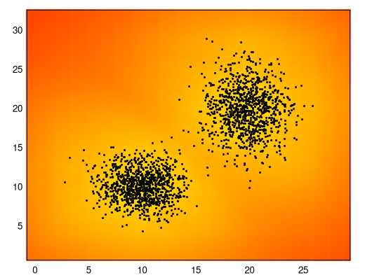 | 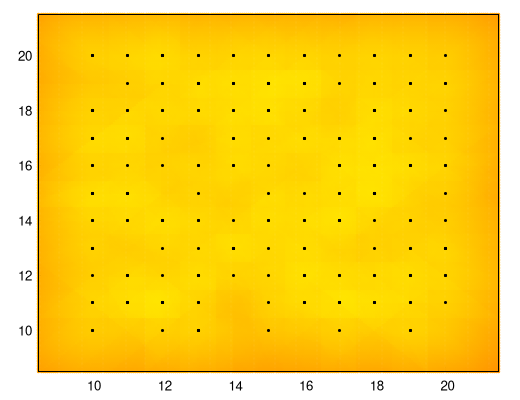 | 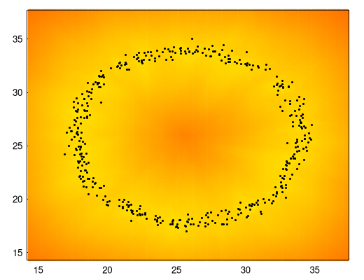 |
| **$T = 0.35$** (Core Inliers) | 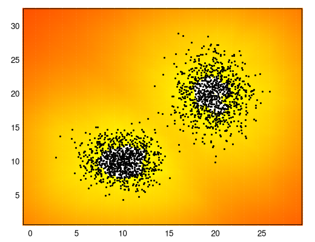 | 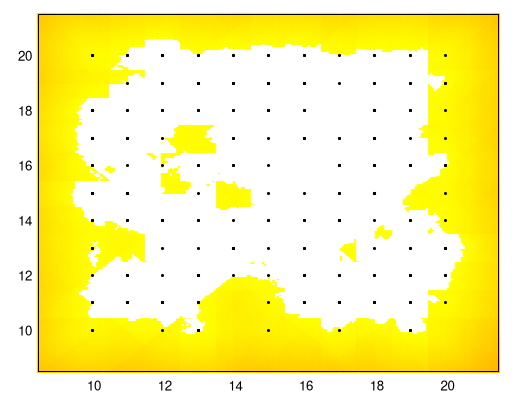 | 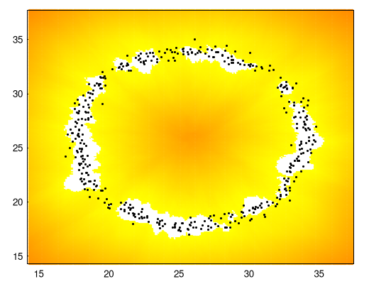 |
| **$T = 0.50$** (Calibrated Default) | 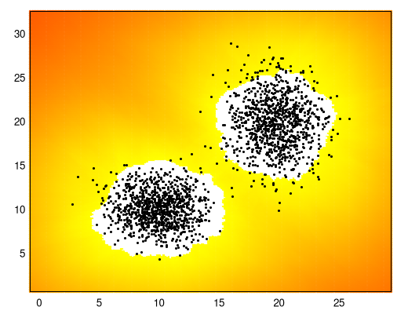 | 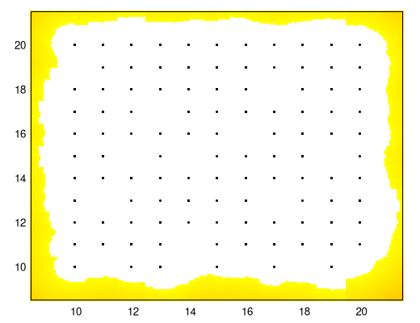 | 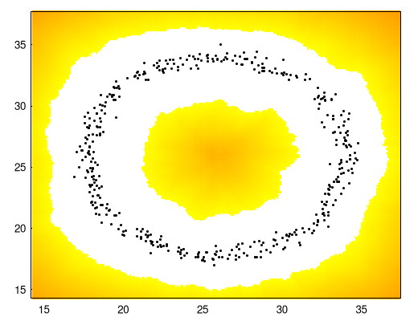 |

### Key Observations:
1. **Zero Kelvin Floor**: At $T = 0.00$, the densest cluster centroids remain almost pure yellow/white, showing that true cluster centers approach the theoretical 0.0 floor without saturation.
2. **Smooth Boundary**: The transition from inlier white to outlier color is smooth and continuous, free from sharp grid axis-aligned cuts.
3. **Consistency**: $T = 0.50$ cleanly isolates both Gaussian blobs, the square perimeter, and the circular ring without requiring topological re-tuning or ad-hoc post-scaling.

---

## 3. Complex Topologies: Concentric Rings & The Teapot

Non-convex manifolds with internal cavities (such as concentric rings or the annular donut hole in `complex2d.csv`) pose a fundamental challenge to hyperplanes, which tend to slice across empty interior voids.

GEIF incorporates **Cauchy-Lorentz Leaf Residual Damping**:
$$H_{\text{attenuated}}(x) = H_{\text{tree}}(x) \cdot \frac{1}{1 + \left(\frac{d_{\text{residual}}(x)}{\delta_{\text{nominal}}}\right)^2}$$

This attenuates metric depth for any test point whose distance to its assigned leaf sample generator exceeds local cluster density, exposing voids cleanly without requiring external k-NN searches.

| Threshold | Concentric Rings (`2circle.csv`) | Complex Teapot (`complex2d.csv`) |
|:---|:---:|:---:|
| **Training Data** | 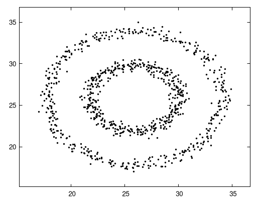 | 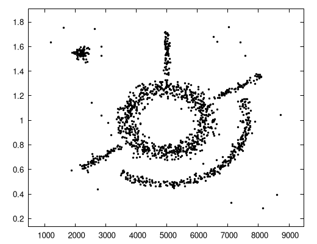 |
| **$T = 0.00$** (Continuous Depth) | 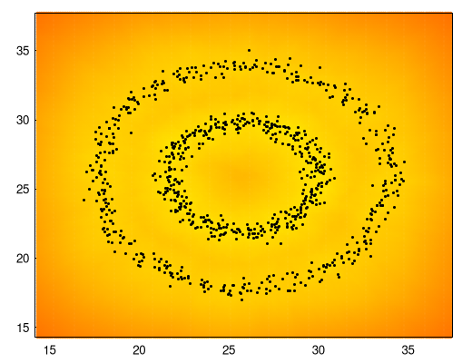 | 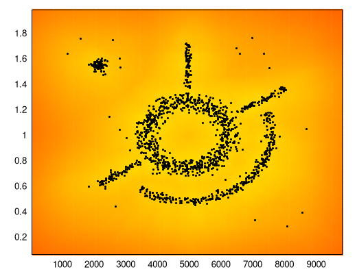 |
| **$T = 0.45$** (Manifold Separation) | 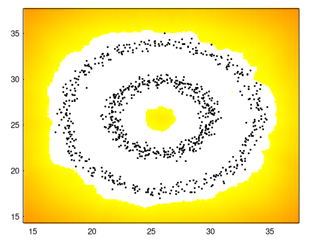 | 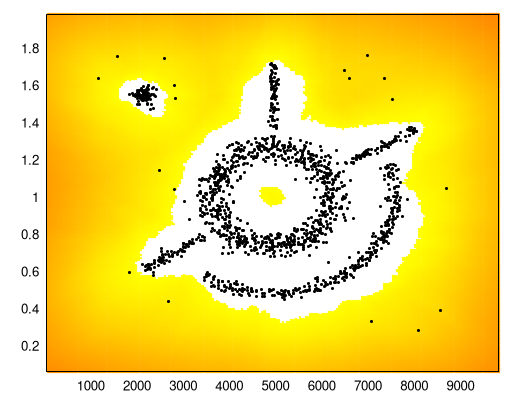 |
| **$T = 0.50$** (Tight Inlier Envelope) | 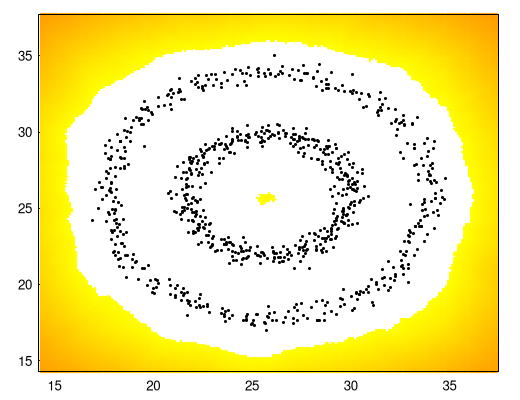 | 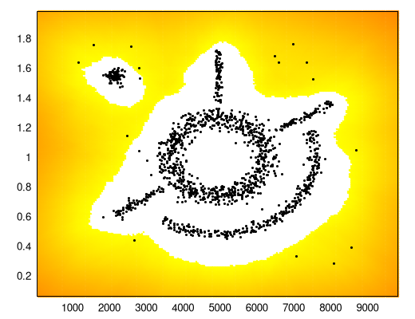 |

### Analysis of Complex 2D:
- **Donut Hole (Cavity)**: The interior void at center $(5000, 1.0)$ is identified as an outlier (colored yellow/orange).
- **Needle Spikes**: The narrow vertical and diagonal needle projections maintain connected inlier envelopes.
- **Isolated Cluster**: The compact Gaussian spot in the top-left quadrant is cleanly resolved as a distinct inlier island.
- **Banana Arc**: The curved crescent manifold on the lower right is crisply traced without merging into the main body.

---

## 4. Extreme Aspect Ratio Invariance (5000:1 Disparity)

When features possess vastly different physical units (e.g., milliseconds vs. packet bytes, or coordinates spanning $[5, 120]$ vs. $[10^5, 2 \times 10^6]$), standard EIF draws random spherical normal vectors that virtually collapse to the axis with the largest numerical span, blinding the model to smaller dimensions.

In `ceif`, this required an explicit auto-scaling normalization pass (`AUTO_SCALE 1`).

In GEIF, **Voronoi midpoint bisectors** are constructed directly from sample pairs:
$$\vec{n} = \frac{B - A}{\|B - A\|}, \quad P_{\text{mid}} = \frac{A + B}{2}$$

Because $A$ and $B$ are drawn directly from the sample distribution, the splitting plane naturally aligns with the true local geometry regardless of coordinate scale.

| Metric | `Wtest.csv` (Span: $X \approx 110, \; Y \approx 1,900,000$) |
|:---|:---:|
| **Raw Training Samples** | 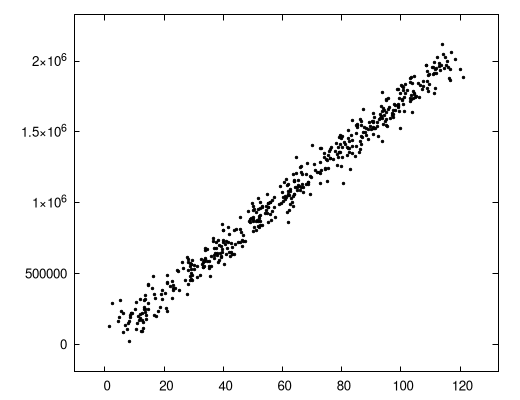 |
| **$T = 0.00$ (Continuous Landscape)** | 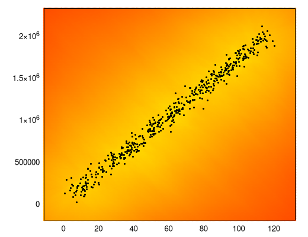 |
| **$T = 0.50$ (Inlier Envelope)** | 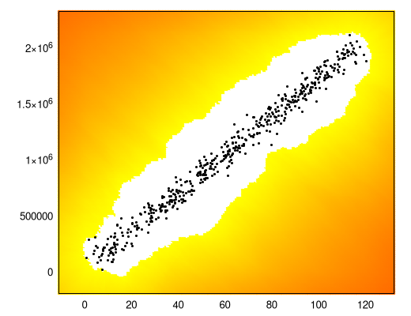 |

**Result**: The narrow diagonal linear band is cleanly enveloped with zero axis distortion and zero configuration overhead.

---

## 5. Outer Space Continuum & Stadium Metric

A known weakness of tree-based partitioning in unbounded Euclidean space is that distant points outside the training bounding box receive arbitrary scores based on whatever leaf hyperplanes happen to extend outwards, often causing starburst rays or wedge artifacts.

GEIF calculates the exact Euclidean distance $d_{\text{out}}$ to the training envelope bounding box:
$$d_{\text{out}}(x) = \sqrt{\sum_{j=1}^D \left(\frac{\max\left(0, \min_j - x_j, x_j - \max_j\right)}{\text{span}_j}\right)^2}$$

As $d_{\text{out}} > 0$, the depth decays exponentially:
$$H_{\text{final}}(x) = H_{\text{tree}}(x) \cdot \exp(-d_{\text{out}}(x))$$

This creates rounded, continuous "stadium" equi-distance shells:

| Wide Area Evaluation ($T = 0.50$) | Deep Outer Space Perimeter ($T = 0.85$) |
|:---:|:---:|
| 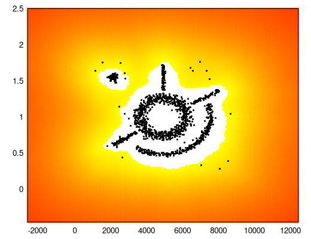 | 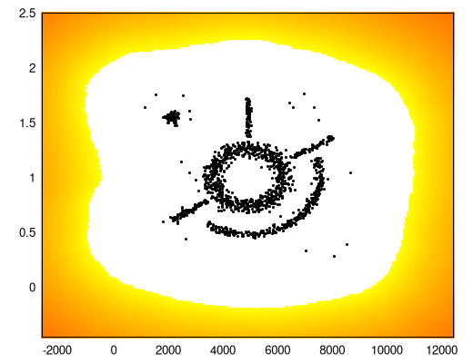 |

### Key Properties:
- **No Starburst Rays**: Decision boundaries remain strictly convex and smoothly rounded in outer space.
- **Monotonic Saturation**: As points travel further into open space, their anomaly score monotonically approaches $1.000000$.

---

## 6. Architectural Comparison: CEIF vs. GEIF

| Capability | CEIF (Extended Isolation Forest) | GEIF (Geometric Extended Isolation Forest) |
|---|---|---|
| **Split Hyperplanes** | Random spherical normals | **Data-driven Voronoi bisectors** between sample pairs |
| **Aspect Ratio Robustness** | Requires explicit min-max normalization (`AUTO_SCALE`) | **Natively scale-invariant** without artificial feature normalization |
| **Cavity / Void Detection** | Post-evaluation nearest-neighbor check (`NEAREST 1`) | **In-tree Cauchy-Lorentz residual cell damping** |
| **Outer Space Geometry** | Distance decay from envelope | **Continuous Euclidean Stadium metric** with rounded corners |
| **Score Scale Calibration** | Ad-hoc post-scaling (`-O 0.5s`) or percentiles (`-O 97%`) | **Calibrated Zero Kelvin Universal Scale** ($H_{\text{max}} = \kappa H_{\text{train,max}}$) |
| **Zero-Variance Columns** | Handled via threshold logic | **Dimension health masking** with zero weight and regularized spans |
| **Ensemble Ingestion** | Reservoir sampling with automatic ceiling factor | **Algorithm R streaming reservoir pool** ($N_{\text{pool}} = T \times \psi$) |
| **Persistence Format** | Binary proprietary format (`.ceif`) | **Standard JSON format** (`json-c`) readable across all platforms |
| **Code Standard** | Classic C | **Strict ISO C17** (`-Wall -Wextra -Wpedantic -O3 -flto -mavx2`) |

---

## 7. Generating These Heatmaps

To reproduce any heatmap in this report:

```bash
# 1. Train model from dataset
./bin/geif -l ../ceif/test/complex2d.csv -w model_complex.json -i 150 -s 256

# 2. Inspect forest summary
./bin/geif -r model_complex.json -q

# 3. Score a test grid or streaming CSV
./bin/geif -r model_complex.json -a test_grid.csv -o scores.csv -T 0.50 -v
```
